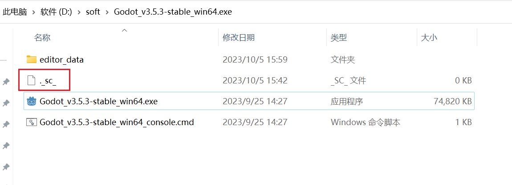

## 安装godot
去官网下载就行，下载下来是一个exe文件，然后像这样放在某个目录下就行

注意：想要在一台电脑上安装不同版本的godot引擎，需要像图里一样，创建一个._sc_文件或者_sc_文件，这样godot引擎就会把相关配置放在 editor_data 这个目录下，不会影响其他版本的引擎。
如果不创建这个文件，那配置文件会保存在

## godot 可以调用外部的IDE进行脚本的编辑，这里记录一下相关的配置
进入 Editor - EditorSetting - Text Editor - External，配置好 “Exec Path” 和 “Exec Flags” 后勾选 “Use External Editor”

- vscode 编辑器设置

```
/Programs/Microsoft VS Code/Code.exe
{project} --goto {file}:{line}:{col}
```

- idea 编辑器设置

```
C:/Program Files/JetBrains/IntelliJ
{project} {file}:{line}
```
